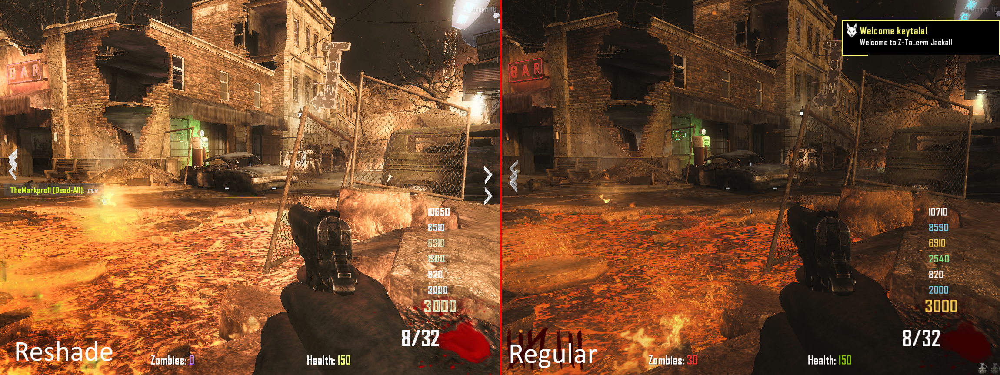

<h1>Reshade-Overlay</h1>

## WARNING: This has worked just fine for me without any warnings/bans. That doesn't mean it couldn't get detected.

**NOTE: This does not work in fullscreen.**

### To access the ReShade menu, sometimes you have to click the application on the taskbar, press <kbd>Insert</kbd>, hover over the application, click the second window with the image, and press <kbd>Home</kbd>.

## Comparison

- This acts as a middleman with clickthrough to use ReShade with a "simulated" depth buffer for games with anticheats against ReShade.
- This should not get you banned in any game you decide to use it on, but this is **not** guaranteed. The clickthrough method could potentially be interpreted as cheating.
